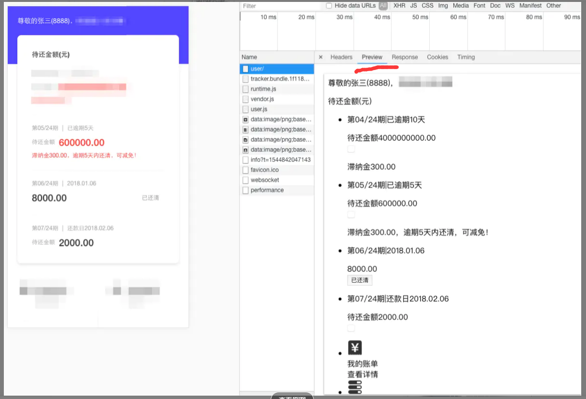
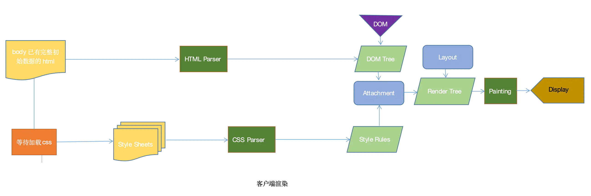
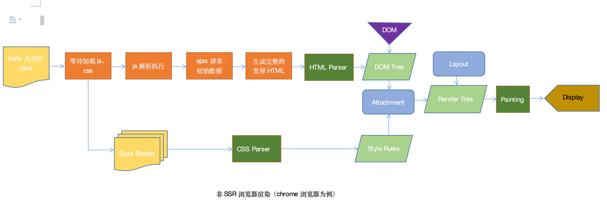

# 1.前端 400 401 403区别
2XX 成功
3XX 重定向
4XX 客户端错误
5XX 服务器错误

- 400 bad request，请求报文存在语法错误(一般是参数错误，)
- 401 unauthorized

     - 未授权：登录失败，用户没有进行身份认证或者身份认证不对
    - 表示发送的请求需要有通过 HTTP 认证的认证信息,权限认证失败（也遇到过账户密码输入错误提示401）

- 403 forbidden，**表示对请求资源的访问被服务器拒绝**
- 404 not found，表示在服务器上没有找到请求的资源（eg:请求的url不存在）
- 415 不支持的媒体类型，一般是content-type格式不对

# 2.JSBridge

 Android app的原生 java 代码与 javascript 代码中架设通信（调用）桥梁的辅助工具

- 主要是js提供给native功能的接口，让混合开发中的前端部分可以方便的调用Native的功能(地址位置，摄像头)
- 是native 和非native之间的桥梁，核心是构建native 和非native之间的通道（双向通道）

双向通信的通道：
- js向native 发送消息，调用相关功能，通知native当前js的状态
- native向js发送消息：回溯调用结果，消息推送，当前native状态

# 3.SSR服务端渲染
将组件或者页面，通过服务器生成html字符串，再发送到浏览器，最后将静态标记‘混合’为客户端上完全交互的应用程序
- 未使用SSR

- SSR


## 优点：
- 利于SEO
- 利于首屏渲染
```
   首屏的渲染是node发送过来的html字符串，并不依赖于js文件了，这就会使用户更快的看到页面的内容。尤其是针对大型单页应用，打包后文件体积比较大，普通客户端渲染加载所有所需文件时间较长，首页就会有一个很长的白屏等待时间。
```

## 局限
- 服务端压力比较大
```
高并发访问的情况，会大量占用服务端CPU资源
```
- 开发条件受限
```
只会执行到componentDidMount之前的生命周期钩子，因此项目引用的第三方的库也不可用其它生命周期钩子，这对引用库的选择产生了很大的限制；
```
- 学习成本比较高（webpack,react，node,koa2）

服务端渲染
- 先向后端服务器请求数据，然后生成完整首屏html返回给浏览器


客户端渲染
- 等js代码下载、加载、解析完成后再请求数据渲染，等待的过程页面是什么都没有的，就是用户看到的白屏


# 4.前端错误如何捕获，promise的错误是如何捕获的
## 常见错误分类：
- js运行时错误
- 静态资源加载错误
- 未处理的Promise错误
- 异步请求错误
  - XMLHttpRequest，
  - fetch api
## 常见捕获方式

### 1.window.onerror和window.addEventListener('error')捕获js运行时错误
 ```
window.onerror = function (msg, url, lineNo, columnNo, error) {
    // 处理错误信息
}

// demo
msg: Uncaught TypeError: Uncaught ReferenceError: a is not defined
error.statck: TypeError: ReferenceError: a is not defined at http://xxxx.js:1:13


window.addEventListener('error', event => (){ 
  // 处理错误信息
}, false);
// true代表在捕获阶段调用，false代表在冒泡阶段捕获。使用true或false都可以，默认为false

 ```
 ### 2.资源加载错误使用addEventListener去监听error事件捕获

 实现原理：当一项资源（如img或script）加载失败，加载资源的元素会触发一个Event接口的error事件，并执行该元素上的onerror()处理函数，error事件不会向上冒泡到window，不过能被window.addEventListener在捕获阶段捕获。
```
window.addEventListener('error', event => (){ 
  // 过滤js error
  let target = event.target || event.srcElement;
  let isElementTarget = target instanceof HTMLScriptElement || target instanceof HTMLLinkElement || target instanceof HTMLImageElement;
  if (!isElementTarget) return false;
  // 上报资源地址
  let url = target.src || target.href;
  console.log(url);
}, true);

```
### 3.未处理的Promise错误

实现原理：当Promise被reject且错误信息没有被处理的时候，会抛出一个unhandledrejection
这个错误不会被window.onerror以及window.addEventListener('error')捕获

window.addEventListener('unhandledrejection')方法进行捕获处理

```
window.addEventListener('rejectionhandled', event => {
  // 错误的详细信息在reason字段
  // demo:settimeout error
  console.log(event.reason);
});

```
### 4.fetch与xhr错误的捕获

通过改写它们的原生方法，在触发错误时进行自动化的捕获和上报

```
// fetch的处理
function _errorFetchInit () {
    if(!window.fetch) return;
    let _oldFetch = window.fetch;
    window.fetch = function () {
        return _oldFetch.apply(this, arguments)
        .then(res => {
            if (!res.ok) { // 当status不为2XX的时候，上报错误
            }
            return res;
        })
        // 当fetch方法错误时上报
        .catch(error => {
            // error.message,
            // error.stack
            // 抛出错误并且上报
            throw error; 
        })
    }
}

```
对于XMLHttpRequest的重写：

```

// xhr的处理
function _errorAjaxInit () {
    let protocol = window.location.protocol;
    if (protocol === 'file:') return;
    // 处理XMLHttpRequest
    if (!window.XMLHttpRequest) {
        return;  
    }
    let xmlhttp = window.XMLHttpRequest;    
    // 保存原生send方法
    let _oldSend = xmlhttp.prototype.send;
    let _handleEvent = function (event) {
        try {
            if (event && event.currentTarget && event.currentTarget.status !== 200) {
                    // event.currentTarget 即为构建的xhr实例
                    // event.currentTarget.response
                    // event.currentTarget.responseURL || event.currentTarget.ajaxUrl
                    // event.currentTarget.status
                    // event.currentTarget.statusText
                });
            }
        } catch (e) {va
            console.log('Tool\'s error: ' + e);
        }
    }
    xmlhttp.prototype.send = function () {
        this.addEventListener('error', _handleEvent); // 失败
        this.addEventListener('load', _handleEvent);  // 完成
        this.addEventListener('abort', _handleEvent); // 取消
        return _oldSend.apply(this, arguments);
    }
}

```

