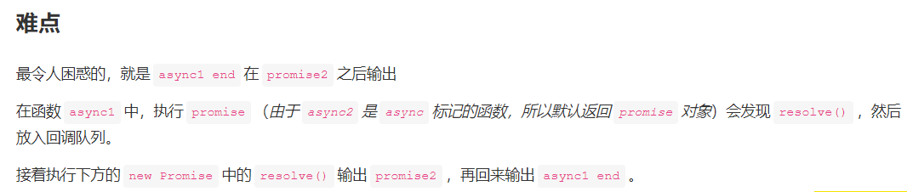
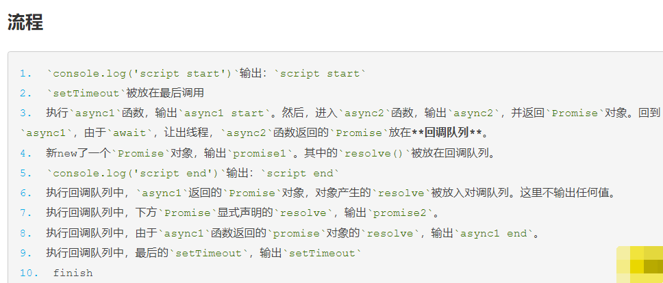

```
async function async1(){
  console.log('async1 start')
  await async2()
  console.log('async1 end')
}

async function async2(){
  console.log('async2')
}

console.log('script start')

setTimeout(function(){
  console.log('setTimeout') 
},0)  

async1();

new Promise(function(resolve){
  console.log('promise1')
  resolve();
}).then(function(){
  console.log('promise2')
})

console.log('script end')

// 输出结果
<!-- script start
async1 start
async2
promise1
script end
promise2
async1 end
setTimeout -->
```

js中的事件循环和回调队列。注意以下几点：

* Promise优先于setTimeout宏任务。所以，setTimeout回调会在最后执行。
* Promise一旦被定义，就会立即执行。
* Promise的reject和resolve是异步执行的回调。所以，resolve()会被放到回调队列中，在主函数执行完和setTimeout前调用。
* await执行完后，会让出线程。async标记的函数会返回一个Promise对象



## !!!!重点看下面转换

## js任务执行顺序：
**执行顺序：同步代码----》微任务(执行完所有微任务)----》宏任务=====》下一轮微任务------》下一轮宏任务-------类推**
```

async function async1(){
  console.log('async1 start')
  await async2()
  console.log('async1 end')
}

// 等价于
async function async1(){
  console.log('async1 start')
  async2().then( _ => {
    console.log( 'async1 end ') // async1 end 所以会放在微任务队列中等待执行
  })
}
```

