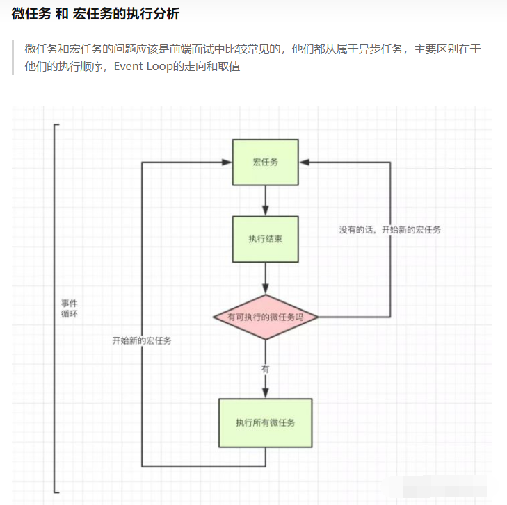
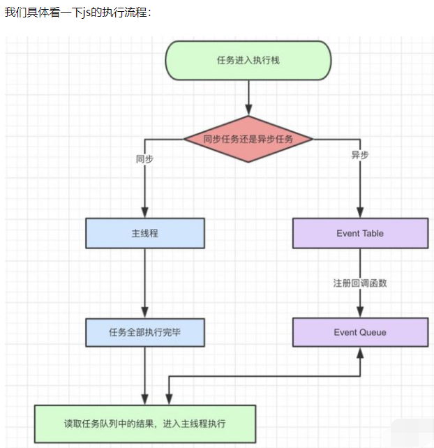

### js语言特点：
- 单线程，同一时间只能做一件事

### Event loop
为了协调事件，用户交互，脚本，ui渲染和网络请求等行为，防止主线程的阻塞，
- Browsing text
- Worker

每一个js 运行的'线程环境'都有一个独立的Event loop

事件循环是通过任务队列的机制来进行协调的

# 1.任务队列
- 每一个事件循环，有多个任务队列，一个任务队列就是多个有序任务的集合
- 每个任务都有一个任务源，源自同一个任务源的task必须放到同一个队列中
- setTimeout,Promise等API都是任务源

### js将任务分为两种
- 同步任务
  - 同步任务都在主线程上执行，形成一个执行栈
  - 主线程之外，时间触发县城管理一个任务队列，异步运行有了运行结果吗，就在任务队列之中放置一个事件
  - 执行栈中所有同步任务执行完毕，系统就会读取任务队列，
- 异步任务
  - 宏任务
  - 微任务

# 2.宏任务，微任务，
## ①宏任务
- setTimeout
- setInterval
- js主代码
- setImmediate(Node)
- requestAnimationFrame(浏览器)
## ②微任务
- Promise的then方法
- process.nextTick



### 1.图解：
- 1）、存在微任务的话，那么就执行所有的微任务
- 2）、微任务都执行完之后，执行下一个宏任务
- 3）、1， 2以此循环着

### 2,微任务的执行顺序注意
- 异步任务尽可能快地执行，那就使用process.nextTick
- Promise对象的回调函数，会进入异步任务里面的”微任务“（microtask）队列

**微任务队列追加在process.nextTick队列的后面。也属于本轮循环**

### 3.为什么要用process.nextTick()？
- 允许用户处理error，清除不需要的资源，或者在事件循环前再次尝试请求
- 有时确保callback在call stack unwound（解除）后，event loop继续循环前 调用


```
// process.nextTick()可用于控制代码执行顺序

process.nextTick(()=>console.log(3))
promise.resolve().then(()=>console.log(4))
//输出为
//3
//4


process.nextTick(()=>console.log(1))
promise.resolve().then(()=>console.log(2))
process.nextTick(()=>console.log(3))
promise.resolve().then(()=>console.log(4))
//输出为
//1
//3
//2
//4
//上面的代码中，process.nextTick的回调会早执行于Promise
```

## process.nextTick()可用于控制代码执行顺序

```
function MyThing(options) {
  this.setupOptions(options);
  process.nextTick(() => {
    this.startDoingStuff();

  });
}
const thing = new MyThing();
thing.getReadyForStuff(); // thing.startDoingStuff() 在准备好之后再调用，而不是在初始化就调用
```


# 3.Event Loop(事件循环)
- 1.同步任务和异步任务分别进入不同的场所，同步的进入主线程，异步的进入Event Table并注册回调函数
- 2.当指定的事情完成时候，Event Table将函数移入Event Queue
- 3.主线程的任务执行完毕为空，会去事件队列中读取相应的函数，进入主线程执行
- 4.上述过程不断重复

